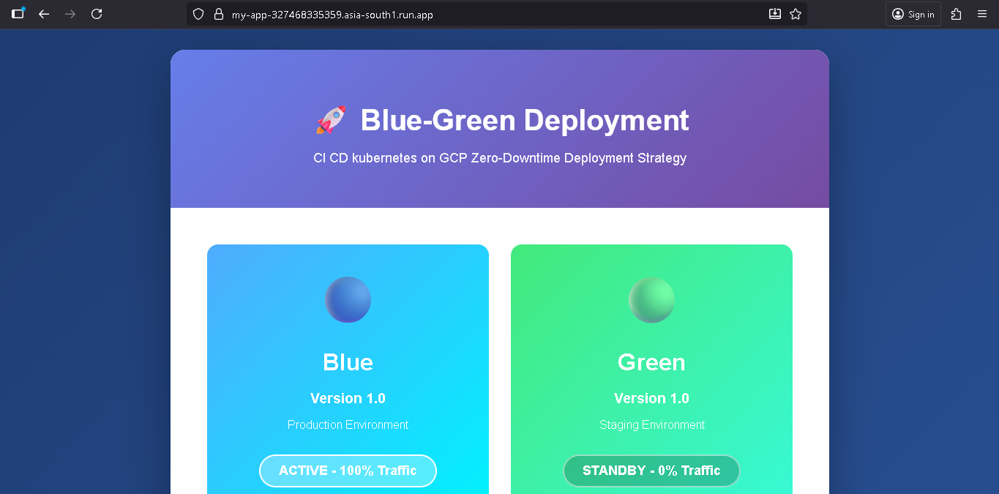
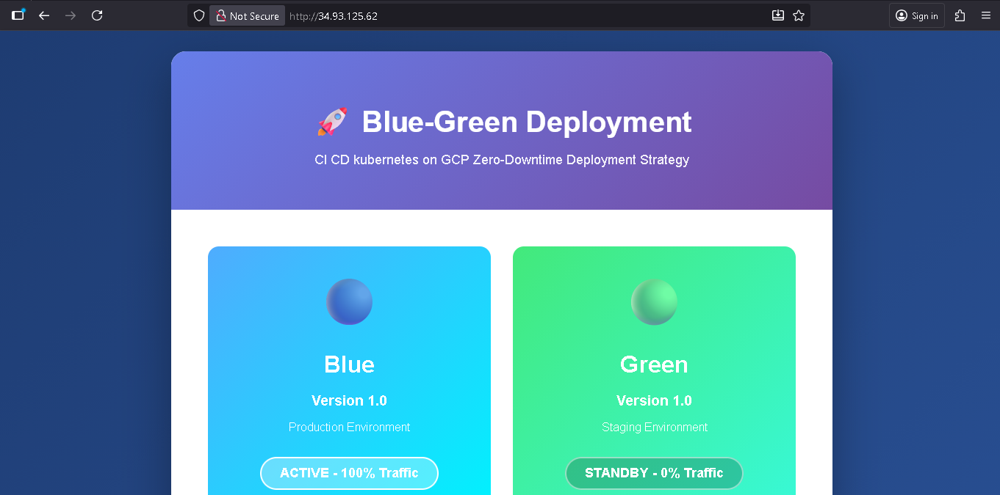
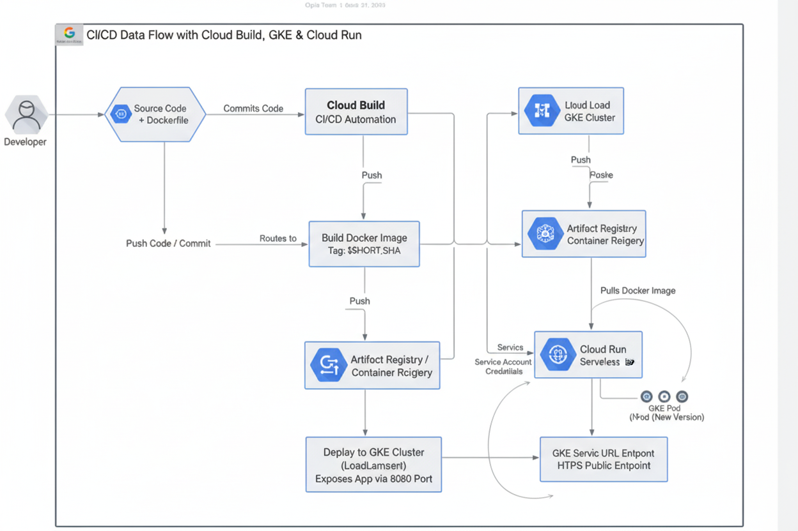

# Blue-Green Deployment on GCP

A production-ready CI/CD pipeline demonstrating zero-downtime deployments using Google Kubernetes Engine (GKE) and Cloud Run with a blue-green deployment strategy.


## 📋 Table of Contents

- [Overview](#overview)
- [Architecture](#architecture)
- [Features](#features)
- [Prerequisites](#prerequisites)
- [Project Structure](#project-structure)
- [Setup Instructions](#setup-instructions)
- [Deployment Process](#deployment-process)
- [Blue-Green Deployment Strategy](#blue-green-deployment-strategy)
- [CI/CD Pipeline](#cicd-pipeline)
- [Configuration](#configuration)
- [Monitoring and Rollback](#monitoring-and-rollback)
- [Troubleshooting](#troubleshooting)
- [Best Practices](#best-practices)
- [Contributing](#contributing)
- [License](#license)

## 🎯 Overview

This project implements an automated CI/CD pipeline that deploys a containerized web application to both Google Cloud Run and Google Kubernetes Engine (GKE). It showcases enterprise-grade deployment practices including:

- **Zero-downtime deployments** using blue-green strategy
- **Automated CI/CD** with Google Cloud Build
- **Container orchestration** with Kubernetes
- **Serverless deployment** with Cloud Run
- **Infrastructure as Code** approach

## 🏗️ Architecture

The application architecture consists of:

- **Frontend**: Interactive web interface demonstrating blue-green deployment
- **Container**: Nginx-based Alpine Linux container
- **Orchestration**: GKE cluster with LoadBalancer service
- **Serverless**: Cloud Run for rapid scaling
- **CI/CD**: Cloud Build with automated triggers
- **Registry**: Google Container Registry (GCR)

### Deployment Flow

```
GitHub Repository → Cloud Build Trigger → Build Docker Image → Push to GCR
                                                ↓
                                    ┌───────────┴───────────┐
                                    ↓                       ↓
                            Deploy to Cloud Run    Deploy to GKE
                            (asia-south1)          (asia-south1)
```

## ✨ Features

- **Automated Builds**: Triggered on Git commits with unique SHA tags
- **Dual Deployment**: Simultaneous deployment to Cloud Run and GKE
- **Blue-Green Strategy**: Zero-downtime version switching
- **Health Checks**: Automated validation before traffic switching
- **Rolling Updates**: Kubernetes-managed gradual rollouts
- **Load Balancing**: GKE LoadBalancer service for traffic distribution
- **Version Control**: Immutable container tags using Git SHA
- **Regional Deployment**: Optimized for asia-south1 region

## 📦 Prerequisites

### Required Tools

- Google Cloud SDK (`gcloud`)
- Docker
- kubectl
- Git

### GCP Requirements

- Active GCP project with billing enabled
- Required APIs enabled:
  - Cloud Build API
  - Cloud Run API
  - Kubernetes Engine API
  - Container Registry API
- IAM permissions:
  - Cloud Build Service Account with GKE/Cloud Run permissions
  - Container Registry admin access

### GCP Setup

```bash
# Set project ID
export PROJECT_ID="your-project-id"
gcloud config set project $PROJECT_ID

# Enable required APIs
gcloud services enable cloudbuild.googleapis.com
gcloud services enable run.googleapis.com
gcloud services enable container.googleapis.com
gcloud services enable containerregistry.googleapis.com
```

## 📂 Project Structure

```
.
├── Dockerfile                 # Multi-stage container build
├── cloudbuild.yaml           # CI/CD pipeline configuration
├── default.conf              # Nginx server configuration
├── index.html                # Application frontend
├── style.css                 # UI styling
├── script.js                 # Blue-green deployment logic
├── k8s/
│   ├── deployment.yaml       # Kubernetes deployment manifest
│   └── service.yaml          # LoadBalancer service configuration
├── images/                   # Architecture diagrams
│   ├── code-build.png
│   ├── gks.png
│   └── projec-architure.png
└── README.md                 # This file
```

## 🚀 Setup Instructions

### 1. Clone the Repository

```bash
git clone <repository-url>
cd <repository-name>
```

### 2. Create GKE Cluster

```bash
gcloud container clusters create my-gke-cluster \
  --region=asia-south1 \
  --num-nodes=2 \
  --machine-type=e2-medium \
  --enable-autoscaling \
  --min-nodes=1 \
  --max-nodes=4
```

### 3. Configure kubectl

```bash
gcloud container clusters get-credentials my-gke-cluster \
  --region=asia-south1 \
  --project=$PROJECT_ID
```

### 4. Deploy Initial Kubernetes Resources

```bash
kubectl apply -f k8s/deployment.yaml
kubectl apply -f k8s/service.yaml
```

### 5. Set Up Cloud Build Trigger

```bash
gcloud builds triggers create github \
  --repo-name=<your-repo> \
  --repo-owner=<your-username> \
  --branch-pattern="^main$" \
  --build-config=cloudbuild.yaml
```

### 6. Grant Cloud Build Permissions

```bash
PROJECT_NUMBER=$(gcloud projects describe $PROJECT_ID --format="value(projectNumber)")

gcloud projects add-iam-policy-binding $PROJECT_ID \
  --member="serviceAccount:${PROJECT_NUMBER}@cloudbuild.gserviceaccount.com" \
  --role="roles/container.developer"

gcloud projects add-iam-policy-binding $PROJECT_ID \
  --member="serviceAccount:${PROJECT_NUMBER}@cloudbuild.gserviceaccount.com" \
  --role="roles/run.admin"
```

## 📤 Deployment Process

### Automated Deployment (Recommended)

1. **Make code changes** and commit to the main branch
2. **Cloud Build automatically triggers** and executes the pipeline
3. **Monitor build progress**:
   ```bash
   gcloud builds list --limit=5
   ```
4. **Verify deployments**:
   ```bash
   # Check Cloud Run
   gcloud run services list --region=asia-south1
   
   # Check GKE
   kubectl get deployments
   kubectl get pods
   kubectl get services
   ```

### Manual Deployment

```bash
# Build and tag image
docker build -t gcr.io/$PROJECT_ID/my-app:v1.0 .

# Push to GCR
docker push gcr.io/$PROJECT_ID/my-app:v1.0

# Deploy to Cloud Run
gcloud run deploy my-app \
  --image=gcr.io/$PROJECT_ID/my-app:v1.0 \
  --region=asia-south1 \
  --allow-unauthenticated

# Update GKE deployment
kubectl set image deployment/my-app my-app=gcr.io/$PROJECT_ID/my-app:v1.0
kubectl rollout status deployment/my-app
```

## 🔄 Blue-Green Deployment Strategy

### What is Blue-Green Deployment?

Blue-green deployment is a release strategy that reduces downtime and risk by running two identical production environments:

- **Blue Environment**: Currently serving production traffic
- **Green Environment**: New version being deployed and tested

### Implementation Steps

1. **Deploy to Standby**: New version deployed to inactive environment
2. **Health Checks**: Automated validation of new deployment
3. **Traffic Switch**: Instantaneous routing from blue to green
4. **Rollback Ready**: Blue environment remains as instant fallback

### Benefits

- ✅ **Zero Downtime**: Instant traffic switching
- ✅ **Easy Rollback**: Previous version ready to activate
- ✅ **Testing in Production**: Validate before traffic switch
- ✅ **Risk Mitigation**: Reduced deployment failures

### Interactive Demo

Open the deployed application URL to see the blue-green deployment visualization:

1. Click **"Deploy New Version"** - Deploys to standby environment
2. Click **"Switch Traffic"** - Routes 100% traffic to new version
3. Monitor the traffic distribution bar showing the switch

## 🔧 CI/CD Pipeline

### Pipeline Stages (cloudbuild.yaml)

#### Stage 1: Build Docker Image
```yaml
- Builds container with unique SHA tag
- Ensures immutable deployments
- Tags: gcr.io/$PROJECT_ID/my-app:$SHORT_SHA
```

#### Stage 2: Push to Container Registry
```yaml
- Uploads image to GCR
- Available for deployment to both platforms
```

#### Stage 3: Deploy to Cloud Run
```yaml
- Serverless deployment
- Auto-scaling enabled
- Public access configured
- Region: asia-south1
```

#### Stage 4: Connect to GKE
```yaml
- Authenticates with cluster
- Configures kubectl context
```

#### Stage 5: Update GKE Deployment
```yaml
- Performs rolling update
- Updates image to new SHA
- Monitors rollout status
- Ensures pod health
```

### Build Variables

- `$PROJECT_ID`: GCP project identifier
- `$SHORT_SHA`: Git commit short SHA (7 characters)
- `$BRANCH_NAME`: Git branch name

## ⚙️ Configuration

### Environment Variables

Update `k8s/deployment.yaml` with your project ID:

```yaml
image: gcr.io/YOUR-PROJECT-ID/my-app:latest
```

### Nginx Configuration

The `default.conf` file configures:
- Listen port: 8080 (Cloud Run compatible)
- Root directory: `/usr/share/nginx/html`
- Default file: `index.html`

### Kubernetes Resources

**Deployment Specs**:
- Replicas: 2 (configurable)
- Container Port: 8080
- Rolling Update strategy

**Service Specs**:
- Type: LoadBalancer
- External Port: 80
- Target Port: 8080

## 📊 Monitoring and Rollback

### Check Deployment Status

```bash
# GKE deployment status
kubectl rollout status deployment/my-app
kubectl get pods -l app=my-app

# Cloud Run service status
gcloud run services describe my-app --region=asia-south1

# View logs
kubectl logs -l app=my-app --tail=100
gcloud run logs read my-app --region=asia-south1 --limit=50
```

### Rollback Procedures

#### GKE Rollback

```bash
# Rollback to previous version
kubectl rollout undo deployment/my-app

# Rollback to specific revision
kubectl rollout undo deployment/my-app --to-revision=2

# View rollout history
kubectl rollout history deployment/my-app
```

#### Cloud Run Rollback

```bash
# List revisions
gcloud run revisions list --service=my-app --region=asia-south1

# Route traffic to previous revision
gcloud run services update-traffic my-app \
  --to-revisions=<REVISION-NAME>=100 \
  --region=asia-south1
```

## 🔍 Troubleshooting

### Common Issues

#### Build Failures

```bash
# View build logs
gcloud builds log <BUILD-ID>

# Check Cloud Build permissions
gcloud projects get-iam-policy $PROJECT_ID \
  --flatten="bindings[].members" \
  --filter="bindings.members:cloudbuild"
```

#### GKE Connection Issues

```bash
# Re-authenticate with cluster
gcloud container clusters get-credentials my-gke-cluster \
  --region=asia-south1 --project=$PROJECT_ID

# Verify connectivity
kubectl cluster-info
kubectl get nodes
```

#### Pod Failures

```bash
# Describe pod for events
kubectl describe pod <POD-NAME>

# Check pod logs
kubectl logs <POD-NAME>

# Check deployment events
kubectl describe deployment my-app
```

#### LoadBalancer Not Accessible

```bash
# Check service status
kubectl get service my-app-service

# Verify external IP assignment
kubectl get service my-app-service -o jsonpath='{.status.loadBalancer.ingress[0].ip}'

# Check firewall rules
gcloud compute firewall-rules list
```

## 🎯 Best Practices

1. **Immutable Tags**: Always use commit SHA for reproducible deployments
2. **Health Checks**: Implement liveness and readiness probes
3. **Resource Limits**: Define CPU and memory limits in deployments
4. **Secrets Management**: Use Google Secret Manager for sensitive data
5. **Monitoring**: Set up Cloud Monitoring and alerting
6. **Backup Strategy**: Regular cluster and data backups
7. **Security**: Enable Binary Authorization and container scanning
8. **Cost Optimization**: Use autoscaling and preemptible nodes

## 🤝 Contributing

Contributions are welcome! Please follow these steps:

1. Fork the repository
2. Create a feature branch (`git checkout -b feature/amazing-feature`)
3. Commit your changes (`git commit -m 'Add amazing feature'`)
4. Push to the branch (`git push origin feature/amazing-feature`)
5. Open a Pull Request

## 📄 License

This project is licensed under the MIT License - see the LICENSE file for details.

## 📞 Support

For issues and questions:
- Open an issue in the GitHub repository
- Check GCP documentation: https://cloud.google.com/docs
- Review Kubernetes documentation: https://kubernetes.io/docs

## 🙏 Acknowledgments

- Google Cloud Platform for infrastructure
- Kubernetes community for orchestration tools
- Nginx for lightweight web serving
- The open-source community

---
## 📸 Screenshots


### 🧱 Cloud Build Pipeline


### ☸️ GKE Deployment


### 🏗️ Project Architecture



**Built with ❤️ for cloud-native deployments**


